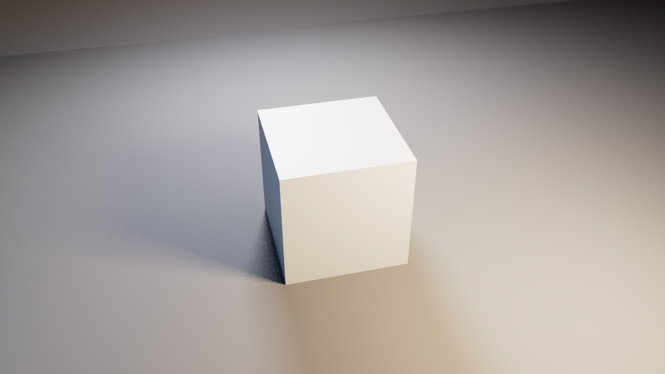

# Lookdev Studio Pro v1.0 (Z-Up Edition)

Una herramienta procedimental en **MEL (Maya Embedded Language)** diseñada para automatizar la creación de entornos de Look Development (Lookdev) fotorealistas en Autodesk Maya para utilizar Arnold Renderer.

## 🎯 El Problema que Resolvemos (Contexto de Producción)
En la industria del 3D, los modeladores y artistas de texturas pierden un tiempo valioso configurando estudios, luces, cicloramas y cámaras solo para presentar sus avances diarios (*dailies*) o renderizar su portfolio. Esta tarea técnica y repetitiva interrumpe el flujo creativo.

**Esta herramienta reduce un proceso de setup manual de 15-20 minutos a un solo clic.** Al automatizar la iluminación física y el encuadre fotográfico basándose en el volumen de la malla, el modelador puede centrarse 100% en la topología y el texturizado, garantizando que siempre entregará renders consistentes, profesionales y listos para revisión sin importar el tamaño o la escala de su modelo.

## 🚀 Características Principales

* **Arquitectura Modular y Escalable:** El script está estructurado en bloques lógicos y aislados (Prevención de Errores, Análisis de Geometría, Generación de Nodos y Apuntado Matemático). Esta separación de responsabilidades permite escalar la herramienta fácilmente en el futuro (ej. añadiendo UIs complejas, integraciones con otros motores de render o exportadores) sin riesgo de corromper el núcleo del código.
* **Escalamiento Procedimental:** Todas las distancias, tamaños de luces y geometría del fondo se calculan matemáticamente usando una unidad maestra derivada del *Bounding Box* del asset.
* **Z-Up Pipeline Ready:** Construcción nativa en coordenadas Z-Up para mantener la consistencia con exportaciones a motores de juego (Unreal Engine / Unity). 
* **Iluminación Física (Arnold):** * Reemplazo de luces estándar por **Area Lights** escaladas proporcionalmente al asset para generar sombras físicamente correctas.
  * Integración de un **SkyDome Light** para iluminación global sutil.
* **Tri-Cam Setup (Batch Render Ready):** Genera y encuadra automáticamente tres cámaras (Main, Side, High) apuntadas al centro de masa del objeto, listas para sacar hojas de contacto (*Contact Sheets*).
* **Safe Mode (Idempotencia):** La herramienta limpia automáticamente nodos huérfanos y grupos de ejecuciones anteriores, garantizando un entorno de trabajo limpio sin choques de nombres (*Name Clashes*).

## 🛠️ Bitácora de Desarrollo y Resoluciones Técnicas
El desarrollo de este script implicó resolver varias inconsistencias en la arquitectura interna de Maya. Estos fueron los principales desafíos superados:

1. **Topología en Z-Up y Extrusiones (El "Techo Negro"):**
   * *Problema:* Al intentar levantar la pared del ciclorama en un entorno Z-Up, el comando `polyExtrudeEdge` en espacio local generaba un plano extendido en el suelo en lugar de una pared vertical.
   * *Solución:* Se forzó la transformación en espacio global (`-ws -wd 0 0 $alto`) y se identificó algorítmicamente la arista correcta (`e[3]`) resultante de la instanciación de un plano orientado al eje Z.

2. **Tipos de Retorno Inconsistentes en MEL:**
   * *Problema:* Los comandos nativos como `spotLight` retornan el nodo *Shape*, mientras que `shadingNode -asLight areaLight` retorna el *Transform*. Esto causaba errores nulos al intentar ajustar las intensidades.
   * *Solución:* Se reemplazó el uso de `shadingNode` por la creación explícita de nodos con `createNode transform` y `createNode areaLight`, asegurando control total sobre la jerarquía y nombramiento desde la línea 1.

3. **Arnold Light Linking (El Render Negro):**
   * *Problema:* Al crear las *Area Lights* vía código puro, estas no iluminaban la escena porque evadían el script oculto de Maya que las añade al motor de render.
   * *Solución:* Se implementó manipulación del *Node Graph* a bajo nivel. Usando `connectAttr`, se conectaron forzosamente las luces al set global: `connectAttr -nextAvailable ($node + ".instObjGroups") "defaultLightSet.dagSetMembers"`.

4. **El Comportamiento de `viewFit` y el Escalamiento Infinito:**
   * *Problema:* Ejecutar `viewFit` mandaba la cámara a coordenadas extremas y la invertía, intentando encuadrar todo el ciclorama masivo junto al modelo.
   * *Solución:* Se aisló temporalmente la selección en un *array* de mallas válidas (`$validMeshes`), excluyendo expresamente al `Cyclorama_GEO` antes de ejecutar el encuadre.

5. **Optimización de AimConstraints:**
   * *Problema:* Redundancia al crear múltiples restricciones de apuntado para luces y cámaras de forma individual.
   * *Solución:* Se unificaron todas las entidades de render en un *Array* y se procesaron mediante un bucle `for`, apuntando todo hacia un único localizador temporal que luego es purgado, manteniendo el código limpio, modular y ágil.

## 💻 Instalación y Uso

1. Abre Autodesk Maya (Asegúrate de que el plugin `mtoa` / Arnold esté cargado).
2. Abre el **Script Editor** (Windows > General Editors > Script Editor).
3. Pega el código del archivo `PhotoStudio_ZUp.mel` en una pestaña de MEL.
4. Selecciona todo el código y arrástralo a tu *Shelf* para crear un botón de acceso rápido o puedes ejecutarlo directamente.
5. **Uso:** Selecciona tu asset en el Viewport y haz clic en el botón "Generar Estudio"(si ejecutaste desde el Script Editor) o presionar el botón de acceso rápido en el *Shelf*.

