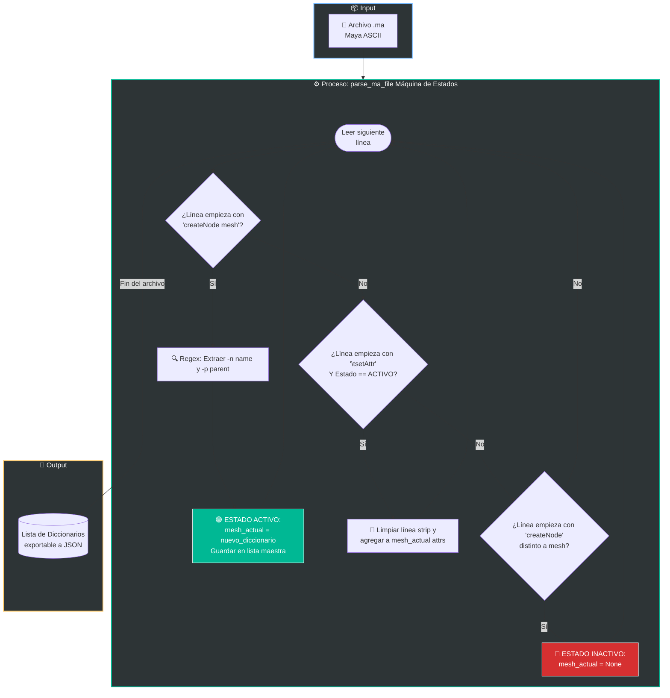

# 🛠️ Guía de Desarrollo: Creando un Parser de Maya ASCII (.ma) a JSON

Esta guía está diseñada especialmente para los miembros del equipo que vienen de la rama de Arte y están dando sus primeros pasos en la parte de desarrollo. 

El objetivo de este documento no es solo enseñar a *usar* la herramienta final, sino explicar **cómo y por qué la construimos**. Entender cómo extraer datos de archivos pesados sin necesidad de abrir la interfaz de Maya es un conocimiento fundamental para auditar miles de escenas en minutos y construir herramientas robustas.

---

## 🏗️ 1. Entendiendo el Archivo .ma (La Anatomía)

Para un artista, una escena de Maya es un espacio 3D visual. Pero para el motor de Maya, un archivo `.ma` (Maya ASCII) no es más que un simple archivo de texto. Es el plano estructural de la escena, escrito como una lista secuencial de comandos MEL.

Si abrimos un archivo `.ma` en un editor de texto (como VS Code), veremos cómo Maya registra la creación de una malla(Desde Maya ir a Save As... y seleccionar el formato de ASCII antes de avanzar):

```mel
createNode transform -n "SM_MiCubo";
createNode mesh -n "SM_MiCuboShape" -p "SM_MiCubo";
	setAttr -k off ".v";
	setAttr ".vir" yes;
```
*Extracto o Snippet de texto crudo traido desde el archivo .ma en formato ASCII*

Nuestra misión: No necesitamos cargar la escena 3D. Solo necesitamos que un script de Python lea este texto de arriba hacia abajo, identifique las palabras clave y extraiga los datos útiles.

## 🔍 2. Expresiones Regulares (El Bisturí del TA)
¿Qué es exactamente una Expresión Regular (o Regex)? Imaginalo como un Ctrl + F (Buscar) con superpoderes. En lugar de buscar una palabra exacta y estática, le damos a Python un patrón lógico de búsqueda. Le enseñamos a reconocer la "forma" de lo que queremos encontrar (por ejemplo: "buscá cualquier texto que esté entre comillas después de un guion"), sin importar qué texto exacto haya ahí adentro.

Para lograr esto, utilizamos el módulo nativo de Python llamado re.

### 🧬 Entendiendo los Flags y la Jerarquía (OOP)
Al leer la línea cruda de Maya (createNode mesh -n "SM_MiCuboShape" -p "SM_MiCubo";), notamos que usa "flags" o etiquetas cortas para asignar propiedades. Las que nos interesan son:

-n (Name): Es el comando que le indica a Maya cuál será el nombre final de la malla.

-p (Parent): Es el comando que le indica a Maya quién es el "padre" de este objeto.

>💡 El concepto de "Padre" (Programación Orientada a Objetos):
Para quienes vienen de arte, piensen en el Outliner: cuando arrastran una geometría dentro de un grupo (o Null), ese grupo se convierte en el "padre" de la geometría (su hijo). En la Programación Orientada a Objetos (OOP), este concepto de herencia y pertenencia es vital. Un "padre" es un contenedor o entidad superior que le transmite propiedades a su hijo (como la posición y rotación en el mundo 3D). Si el código elimina o transforma al padre, el hijo sufre las consecuencias directamente.

### 🛠️ Aplicando el Patrón de Búsqueda
En lugar de decirle a Python que busque una palabra exacta, le decimos: "Buscá el flag -n, seguido de un espacio y unas comillas, y capturá todo lo que haya adentro".
```python
import re

# Patrón para capturar el nombre (flag -n)
regex_name = re.compile(r'-n "(.*?)"')

# Patrón para capturar el padre (flag -p)
regex_parent = re.compile(r'-p "(.*?)"')
```
### Anatomía de nuestro patrón:

- La letra r al inicio (r'...'): Le indica a Python que esto es un "Raw String" (texto crudo). En código, símbolos como la barra invertida (\\) suelen usarse para comandos especiales (como \n para un salto de línea). Al poner la r antes de las comillas, le decimos a Python: "Apagá la interpretación de comandos especiales y leé este texto literalmente, símbolo por símbolo". Es una regla de oro al escribir Regex para evitar bugs.

- El comodín (.*?): Este es nuestro bisturí. Los paréntesis le indican a Python que queremos "capturar" (guardar en memoria) lo que está adentro. El punto, el asterisco y el signo de interrogación combinados le dicen a la máquina: "atrapá cualquier carácter que encuentres, pero detenete inmediatamente apenas choques con la siguiente comilla doble".

## ⚙️ 3. La Máquina de Estados (El Motor de Lectura)
Maya no escribe toda la información de un nodo en una sola línea. Primero escribe createNode y luego, en las líneas siguientes tabuladas, escribe los atributos con setAttr(Set Attributes).

Para resolver esto sin perdernos, programamos una lógica llamada Máquina de Estados. Funciona como un interruptor de grabación:

1. Estado Inactivo (Apagado): El script lee líneas y las ignora.

2. Activación: Si el script lee la frase createNode mesh, el interruptor se enciende (Estado Activo). Sabe que encontró geometría. Usa el Regex para guardar el nombre y el padre.

3. Recolección: Mientras el interruptor siga encendido, cualquier línea que empiece con setAttr se guarda en la mochila de este nodo específico.

4. Desactivación: Si el script detecta otro createNode (por ejemplo, una cámara o una luz), apaga el interruptor para no mezclar los atributos.

### 🗺️ Diagrama de Flujo Lógico
A continuación, la representación visual de la arquitectura de nuestra Máquina de Estados. Este es el recorrido exacto que hace nuestro código Python por cada línea del archivo .ma:



## 🚀 Conclusión
Dominar este tipo de operaciones de "bajo nivel" (leer texto en crudo) nos independiza de los tiempos de carga de los DCCs (Digital Content Creators). Un script batch diseñado de esta manera puede procesar miles de escenas pesadas en servidores externos durante la noche y exportar todo un reporte en JSON limpio, asegurando que nuestro pipeline de producción nunca se detenga por un nodo corrupto.