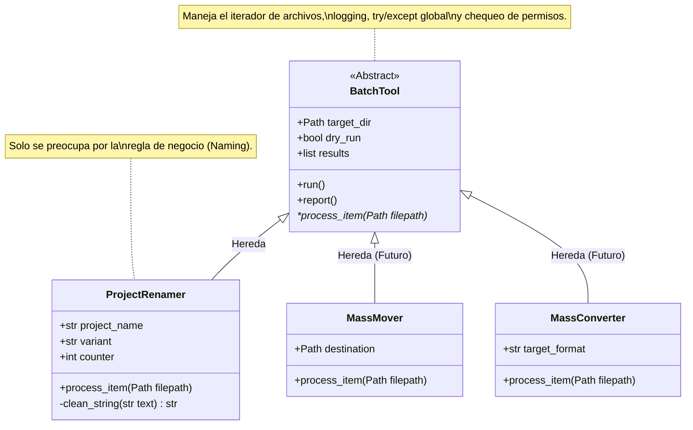

# 🛠️ Project Renamer & BatchTool Framework

Esta herramienta de línea de comandos (CLI) está diseñada para normalizar masivamente los nombres de assets en producciones de VFX y Videojuegos, aplicando convenciones de nomenclatura estrictas (`proyecto_asset_variant_v###.ext`).

Más allá de ser un simple renombrador, este script fue desarrollado utilizando **Programación Orientada a Objetos (POO)** y define un framework base (`BatchTool`) del cual se pueden derivar futuras herramientas de procesamiento masivo.

---

## 🏗️ Arquitectura del Sistema

Para evitar la duplicación de código en el futuro, la lógica común (iteración de archivos, reportes visuales, manejo de errores de permisos y el sistema de prevención "Dry Run") se abstrajo en una clase base. `ProjectRenamer` simplemente hereda esta infraestructura y aplica su regla de negocio específica.



## 🚀 Requisitos e Instalación
Esta herramienta utiliza rich para generar tablas visuales en la consola y facilitar la lectura de los reportes.

Asegurate de tener activado tu entorno virtual (.venv).

Instalá las dependencias necesarias:
```bash
pip install rich
```

## ⚙️ Cómo Usar la Herramienta (CLI)
Por seguridad, la herramienta opera por defecto en modo Dry-Run. Esto significa que escaneará la carpeta y mostrará una tabla con los cambios propuestos, pero no modificará físicamente ningún archivo hasta que se le indique explícitamente.

Argumentos:
- directory (Requerido): La ruta a la carpeta que contiene los assets.

- -p / --project (Requerido): El acrónimo o nombre del proyecto (Ej: FILM, PRJ1).

- -v / --variant (Opcional): La variante del asset. Por defecto es base (Ej: proxy, lookdev, high).

- --apply (Opcional): Atención: Usar este flag ejecuta los cambios físicamente en el disco.

## 💻 Ejemplos de Uso
### 1. Simulación Segura (Dry-Run)
Ideal para auditar cómo quedarían los nombres antes de cometer un error irreparable.
```bash
python project_renamer.py ./mis_assets_crudos -p "PROYECTO" -v "lookdev"
```

Salida esperada: Una tabla visual generada por rich mostrando la columna de "Archivo Original" y "Nuevo Archivo", con estado "Pendiente (Dry Run)".

### 2. Ejecución Real (Apply)
Si la simulación fue correcta, añadimos el flag --apply para ejecutar el renombrado.
```bash
python project_renamer.py ./mis_assets_crudos -p "PROYECTO" -v "lookdev" --apply
```

Salida esperada: 
1. Los archivos se renombrarán en el disco limpiando tildes, espacios y caracteres especiales.
2. La consola mostrará el estado "Renombrado OK".
3. Se generará automáticamente un archivo rename_log_YYYYMMDD_HHMMSS.txt en la raíz con el registro técnico de toda la operación (útil para auditorías de producción).

## 🫂 Para futuros Technical Artists (Extensibilidad)
Si necesitas crear una nueva herramienta masiva (por ejemplo, un script que mueva archivos de texturas a carpetas específicas), no programes todo desde cero.

Importá la clase abstracta BatchTool.

Creá tu nueva clase heredando de ella (Ej: class MassMover(BatchTool):).

Sobrescribí únicamente la función process_item(self, filepath: Path).

El framework se encargará automáticamente de proteger la ejecución, manejar los crashes y armarte la tabla de reporte final.

