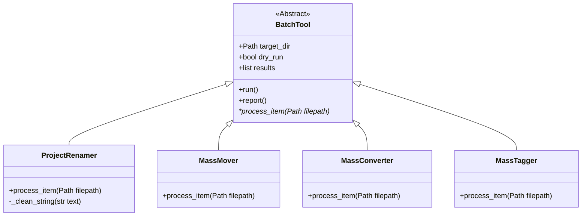

# 🛠️ Project Renamer & BatchTool Framework
---
Esta suite de herramientas CLI permite automatizar tareas de pipeline a gran escala, eliminando la intervención manual y garantizando la consistencia en producciones de VFX, Juegos y Virtual Production.

El framework está construido sobre un principio de Programación Orientada a Objetos (POO): la lógica compleja de manejo de archivos, errores y reportes reside en una clase base abstracta, permitiendo escalar a nuevas herramientas en minutos.

Diseñé BatchTool como una clase abstracta para desacoplar la lógica de gestión de archivos (iteración, logging, dry-run, reporte) de la regla de negocio (qué renombrar, qué mover, qué convertir). Esto hace que cualquier desarrollador junior pueda agregar una herramienta nueva en 10 líneas de código sin riesgo de romper el sistema de logging o los tests globales.

---

## 🏗️ Arquitectura del Sistema

Para evitar la duplicación de código, la lógica de procesamiento masivo se abstrajo en una clase base BatchTool.


## 🧩 Desglose de BatchTool
- run(): Motor principal que itera archivos, ignora logs/carpetas y maneja excepciones globales (permisos, bloqueos).

- process_item(filepath): Método abstracto que define la "regla de negocio" para cada herramienta específica.

- report(): Genera una tabla visual de resultados mediante la librería rich.

## 📂 Estructura del Repositorio y Convenciones

### Árbol del Proyecto
```text
F2-W1-3/
├── assets_test/           # Sandbox para pruebas de archivos
├── config.json            # Configuración externa de nomenclatura
├── project_renamer.py     # Herramienta principal de nombrado
├── derived_tools.py       # Ecosistema (MassMover, MassConverter, MassTagger)
├── test_project_renamer.py # Suite de tests (pytest)
└── rename_log_*.txt       # Logs generados automáticamente
```


## 🚀 Requisitos e Instalación
Esta herramienta utiliza rich para generar tablas visuales en la consola y facilitar la lectura de los reportes.

Asegurate de tener activado tu entorno virtual (.venv).

Instalá las dependencias necesarias:
```bash
pip install rich
```

## ⚙️ Uso de la Herramienta (CLI)
1. Project Renamer
Aplica la convención definida en config.json ({project}_{asset}_{variant}_v{version}{ext}).

- Simulación (Segura):
```bash
python project_renamer.py ./assets -p "FILM" -v "lookdev"
```
- Aplicación Real:
```bash
python project_renamer.py ./assets -p "FILM" -v "lookdev" --apply
```


## 💻 Ejemplos de Uso
### 1. Simulación Segura (Dry-Run)
Ideal para auditar cómo quedarían los nombres antes de cometer un error irreparable.
```bash
python project_renamer.py ./mis_assets_crudos -p "PROYECTO" -v "lookdev"
```

Salida esperada: Una tabla visual generada por rich mostrando la columna de "Archivo Original" y "Nuevo Archivo", con estado "Pendiente (Dry Run)".

### 2. Ejecución Real (Apply)
Si la simulación fue correcta, añadimos el flag --apply para ejecutar el renombrado.
```bash
python project_renamer.py ./mis_assets_crudos -p "PROYECTO" -v "lookdev" --apply
```

Salida esperada: 
1. Los archivos se renombrarán en el disco limpiando tildes, espacios y caracteres especiales.
2. La consola mostrará el estado "Renombrado OK".
3. Se generará automáticamente un archivo rename_log_YYYYMMDD_HHMMSS.txt en la raíz con el registro técnico de toda la operación (útil para auditorías de producción).

## 🫂 Para futuros Technical Artists (Extensibilidad)
¿Necesitás crear una herramienta nueva (Ej: MassMover)?

1. Importá la clase base: from project_renamer import BatchTool.

2. Heredá de ella y sobrescribí únicamente el método process_item(self, filepath).

3. Tu nueva tool tendrá automáticamente soporte para dry-run, logs y tablas de reporte.

## 🧪 Pruebas Automatizadas
El sistema está validado con una suite de tests que cubren casos extremos (nombres con caracteres extraños, archivos sin extensión, archivos ya correctamente nombrados):
```bash
pytest test_project_renamer.py -v
```
